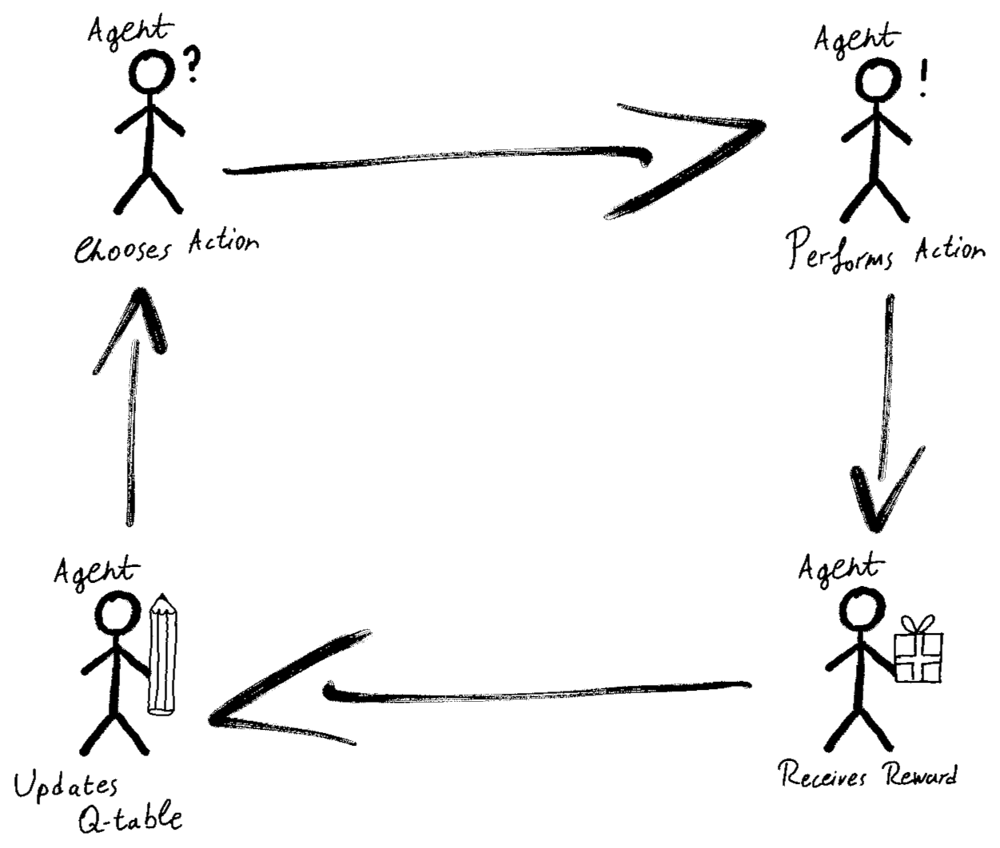

# Human Diffusion

Human Diffusion is a Q-Learning model that simulates the human migration from Africa. This project was developed for the Statistical Machine Learning course at the University of Torino.


## Overview

The model uses Q-Learning to simulate the movement of early humans out of Africa and into other parts of the world. The model uses a grid-based representation of the world map and simulates human migration by learning the most rewarding paths. It takes into account the physical barriers, such as oceans and mountains, as well as potential migration paths like the Arabian Bridge, Indonesian Bridge, and Bering Strait. Unfortunately implementing mountain ranges and deserts would take too much time, and would be useless, since the report had a 6-page constraint.

The simulation begins with a starting area in Africa and generates migration routes based on Q-Learning, a reinforcement learning technique. The model learns to take actions (move west, east, north, or south) to maximize rewards, which are given based on the desirability of a location.

Below is a simple explanation of the Q-Learning algorithm, which I unfortunately couldn't use in the LaTeX due to space constraints.



### Results

The simulation generates a visual representation of the migration routes taken by early humans as they moved out of Africa. The model is able to learn the most efficient routes given the constraints of the physical environment, and produces a map that closely resembles the actual migration patterns of early humans.

## Getting Started

### Prerequisites

To run this project, you will need to have Python 3.x installed, along with the following Python libraries:

-   NumPy
-   Matplotlib
-   tqdm

You can install them using `pip`:

```bash
pip install numpy matplotlib tqdm
```
or
```bash
pip install -r "requirements.txt"
```

### Running the Simulation

1.  Clone this repository:

```bash
git clone https://github.com/your-username/Human-Diffusion.git
cd Human-Diffusion
```

2.  Run the `main.py` script to train the Q-Learning model:

```bash
python main.py
```

This will start the training process and save the Q table, reward per episode, and lifetime data in `.npy` files.

3.  Visualize the results of the trained model by running the `display_results.py` script:

```bash
python display_results.py
```
This will display the average reward, average lifetime of the group, and the final migration path.

## Code Structure

The project consists of three main files:

-	`earth.py`: Contains the `Earth` class, that creates the map.
-   `human_migration.py`: Contains the `HumanMigration` class, which encapsulates the Q-Learning model, training process, and visualization methods.
-   `main.py`: A script that imports the `HumanMigration` class, trains the model, and saves the results.

The `display_results.py` script is used to visualize the results of the trained model.

## Additional Visualizations

The code also includes two additional visualizations to help analyze the performance of the Q-Learning algorithm throughout the simulation:

1.  **Average Reward**: This plot shows the average reward per episode over a defined interval (e.g., every 10% of the total episodes). The average reward provides insights into how well the algorithm is learning to navigate the environment and find desirable locations.

2.  **Average Lifetime of Group**: This plot illustrates the average number of generations the group survived before either reaching a desirable location or encountering a barrier. This can be used to evaluate the effectiveness of the learned migration routes.

## License

This project is licensed under the MIT License - see the LICENSE file for details.
